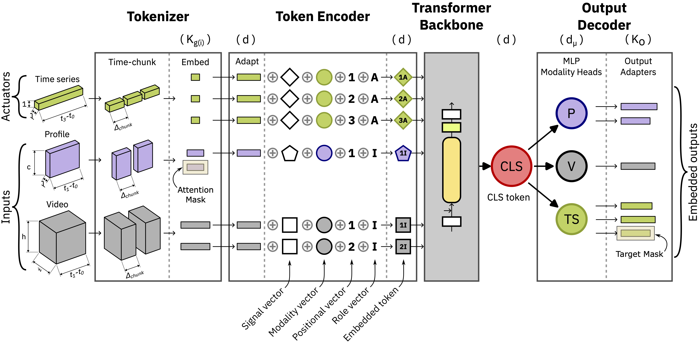

# TokaMind

MMT is a **multi-modal, token-based Transformer** designed for scientific / industrial sensor data (e.g. time-series, profiles, video) with a **clean separation** between:

- **`src/mmt/`**: the *dataset-agnostic* core library (model + data pipeline primitives)
- **`scripts_mast/`**: the FAIR/MAST integration layer (task configs, dataset wiring, training/eval scripts)

If you’re new to the repo, start with the **toy example** in `examples/` (runs on synthetic data and does not require the benchmark dataset stack), then move to `scripts_mast/` for real tasks.

---

## Description

This repo implements a schema-flexible tokenization pipeline and a modular Multi-Modal Transformer with per-output adapters.

[](assets/mmt_architecture.pdf)
*Figure: Tokenization + model flow.* Windowed multimodal inputs/actuators are chunked and compressed by signal-specific codecs into tokens. 
Tokens are projected to a shared model dimension (with metadata embeddings), processed by a Transformer backbone, and mapped 
to targets via modality heads + per-output adapters; masks handle missing inputs/targets without imputation.

Key features:

- **Dataset-agnostic core (`mmt/`)**: the model and token pipeline are reusable across domains.
- **Convention-based configuration**: common defaults + per-task overrides, with phases for `pretrain`, `finetune`, `eval`, and `tune_dct3d`.
- **Per-task embedding tuning**: `run_tune_dct3d.py` writes `embeddings_overrides/<profile>.yaml` inside the task folder (default profile: `dct3d`).
- **Flexible training/evaluation**: warm-start vs resume, forced-drop ablations at eval time, cached vs streamed datasets.

For deeper details, see:
- `docs/model_architecture.md`
- `docs/transforms.md`
- `docs/model_flexibility.md`


## 📦 Installation

This submission consists of up to three local repositories (we suggest to leave them side-by-side in the same parent folder):

- `fairmast-data-preprocessing/` (TokaMark benchmark + data utilities)
- `tokamind/` (TokaMind framework)
- `vae-fairmast/` (optional: VAE embeddings used for Group-1 experiments)

### 1) Create and activate a conda environment

> **TO UPDATE**: add git folder address of benchmark and VAE when available

**Recommended Python:** **3.11+**
```bash
conda create -n tokamind-env python=3.12
conda activate tokamind-env
```

**For Windows users, install `wheels` and `setuptools`:**
```bash
pip install -U pip setuptools wheel
```

### 2) Install TokaMind

```bash
cd ../tokamind
pip install -e .
# pip install -e ".[dev]"
```

### 3) Install the benchmark/data package

Benchmark integration to run Script MAST

```bash
cd fairmast-data-preprocessing
pip install -e .
```

### 4) (Optional) Install VAE embeddings support

Only needed to reproduce the VAE embedding experiments for Group-1.

```bash
cd ../vae-fairmast
pip install -e .
```


[//]: # (## 📦 Installation)

[//]: # ()
[//]: # (There are two common workflows:)

[//]: # ()
[//]: # (1&#41; **Core install + toy example** &#40;recommended first; no benchmark required&#41;  )

[//]: # (2&#41; **Full MAST integration** &#40;requires the benchmark repository and datasets&#41;)

[//]: # ()
[//]: # (### 1&#41; Install MMT &#40;core library&#41;)

[//]: # ()
[//]: # (Clone and install in editable mode:)

[//]: # ()
[//]: # (```bash)

[//]: # (git clone https://github.com/<org>/multi-modal-transformer.git)

[//]: # (cd multi-modal-transformer)

[//]: # ()
[//]: # (python -m pip install -U pip)

[//]: # (pip install -e .)

[//]: # (# Optional developer extras:)

[//]: # (pip install -e ".[dev]")

[//]: # (```)

[//]: # ()
[//]: # (Smoke test with synthetic data:)

[//]: # ()
[//]: # (```bash)

[//]: # (python examples/toy_train.py --config examples/configs/toy.yaml)

[//]: # (```)

[//]: # ()
[//]: # (### 2&#41; Full MAST integration &#40;benchmark repository&#41;)

[//]: # ()
[//]: # (This repository is designed to run on top of a **Benchmark Environment** &#40;FAIR/MAST preprocessing + datasets&#41;.)

[//]: # ()
[//]: # (Follow these steps:)

[//]: # ()
[//]: # (#### a&#41; Install the benchmark repository)

[//]: # ()
[//]: # (```bash)

[//]: # (git clone https://github.com/<org>/<benchmark-repo>.git)

[//]: # (cd <benchmark-repo>)

[//]: # ()
[//]: # (# complete block &#40;dataset + deps&#41;)

[//]: # (```)

[//]: # ()
[//]: # (Make sure the benchmark repo is importable in the same Python environment used by MMT)

[//]: # (&#40;e.g., via `pip install -e .` in the benchmark repo, or by setting `PYTHONPATH`&#41;.)

[//]: # ()
[//]: # (#### b&#41; Install MMT)

[//]: # ()
[//]: # (```bash)

[//]: # (git clone https://github.com/<org>/multi-modal-transformer.git)

[//]: # (cd multi-modal-transformer)

[//]: # ()
[//]: # (pip install -e .)

[//]: # (pip install -e ".[dev]")

[//]: # (```)

[//]: # ()
[//]: # (---)

## Usage

### 1) Benchmark-free toy example (synthetic data)

Runs a tiny training loop on synthetic data to demonstrate the core APIs::

```bash
python src/mmt/examples/toy_train.py --config src/mmt/examples/configs/toy.yaml
```

### 2) Run training/evaluation with MAST integration

All phase scripts use the same pattern: pass a **task folder name** under

All phase scripts also accept `--emb_profile <profile>` to select which task-level embedding overrides to use (default: `dct3d`).
`scripts_mast/configs/tasks_overrides/<task>/`.

**Pretrain** (supports `--run-id` or `--tag` for naming):

```bash
# Foundation model with explicit name
python scripts_mast/run_pretrain.py --task pretrain_inputs_actuators_to_inputs_outputs --run-id tokamind_v1

# Task-specific model with tag (creates: task_1-1_small_v2)
python scripts_mast/run_pretrain.py --task task_1-1 --tag small_v2

# Default: uses task name as run_id
python scripts_mast/run_pretrain.py --task task_1-1
```

**Priority:** `--run-id` (explicit) > `--tag` (generates `{task}_{tag}`) > task name

**Finetune** (requires `--model` to specify source model):

```bash
# Finetune from a pretrained model
python scripts_mast/run_finetune.py --task task_2-1 --model pretrain_inputs_actuators_to_inputs_outputs

# With optional experiment tag for versioning
python scripts_mast/run_finetune.py --task task_2-1 --model pretrain_inputs_actuators_to_inputs_outputs --tag experiment1
```

This auto-generates run_id as: `ft-{task}-{tag}-{model_id}` (or `ft-{task}-{model_id}` if no tag)

**Evaluate** (requires `--model` to specify which model to evaluate):

```bash
# Evaluate a finetuned model
python scripts_mast/run_eval.py --task task_2-1 --model ft-task_2-1-experiment1-pretrain_inputs_actuators_to_inputs_outputs

# Or evaluate a pretrained model directly
python scripts_mast/run_eval.py --task task_2-1 --model pretrain_inputs_actuators_to_inputs_outputs
```

Evaluation results are saved in `runs/{model}/eval/`

Tune embedding parameters (DCT3D) for a task:

```bash
python scripts_mast/run_tune_dct3d.py --task task_2-1
```

This writes:

```
scripts_mast/configs/tasks_overrides/<task>/embeddings_overrides/dct3d.yaml
```

### 3) Configuration

Configuration is **convention-based** with **CLI-based model selection**. The loader merges:

1) `scripts_mast/configs/common/embeddings.yaml`
2) `scripts_mast/configs/common/<phase>.yaml`
3) `scripts_mast/configs/tasks_overrides/<task>/<phase>_overrides.yaml` *(optional)*
4) `scripts_mast/configs/tasks_overrides/<task>/embeddings_overrides/<profile>.yaml` *(required for pretrain/finetune; create an empty file if you do not want task-specific overrides yet)*

**Key Changes:**
- **Model selection via CLI**: Use `--model` argument instead of editing YAML configs
- **Auto-generated run IDs**: Finetune runs are named `ft-{task}-{tag}-{model_id}`
- **No manual config editing**: Model sources and run IDs are set automatically from CLI arguments

**Notes:**
- Each phase config must explicitly define: `seed`, `runtime`, `data.local`, `data.subset_of_shots`
- Finetune and eval phases require `--model` CLI argument (no longer in YAML)
- Optional `--tag` for finetune allows experiment versioning
- All phases accept `--emb_profile <profile>` to select embedding overrides (default: `dct3d`)

See:
- `docs/config_guide.md` — detailed configuration guide
- `docs/config_reference.md` — CLI arguments and config reference

---

## Documentation

Recommended reading order:

- `docs/config_guide.md` — config structure, merge order, phases, and run directories
- `docs/model_architecture.md` — model blocks and data flow
- `docs/model_flexibility.md` — warm-start/resume, finetune/eval flexibility
- `docs/datasets.md` — cached vs streamed datasets, epoch semantics
- `docs/transforms.md` — transforms pipeline and window dict contract
- `docs/checkpointing_and_warmstart.md` — checkpoints, overlap loading, model parts
- `docs/evaluation.md` — metrics/traces, forced-drop ablations, eval outputs
- `docs/tuning_embeddings.md` — DCT3D tuning and `embeddings_overrides/<profile>.yaml`

[//]: # (## Support)

[//]: # (Tell people where they can go to for help. It can be any combination of an issue tracker, a chat room, an email address, etc.)

[//]: # ()
[//]: # (## Roadmap)

[//]: # (If you have ideas for releases in the future, it is a good idea to list them in the README.)

[//]: # ()
[//]: # (## Contributing)

[//]: # (State if you are open to contributions and what your requirements are for accepting them.)

[//]: # ()
[//]: # (For people who want to make changes to your project, it's helpful to have some documentation on how to get started. Perhaps there is a script that they should run or some environment variables that they need to set. Make these steps explicit. These instructions could also be useful to your future self.)

[//]: # ()
[//]: # (You can also document commands to lint the code or run tests. These steps help to ensure high code quality and reduce the likelihood that the changes inadvertently break something. Having instructions for running tests is especially helpful if it requires external setup, such as starting a Selenium server for testing in a browser.)

[//]: # ()
[//]: # (## Authors and acknowledgment)

[//]: # (Show your appreciation to those who have contributed to the project.)

[//]: # ()
[//]: # (## License)

[//]: # (For open source projects, say how it is licensed.)

[//]: # ()
[//]: # (## Project status)

[//]: # (If you have run out of energy or time for your project, put a note at the top of the README saying that development has slowed down or stopped completely. Someone may choose to fork your project or volunteer to step in as a maintainer or owner, allowing your project to keep going. You can also make an explicit request for maintainers.)
